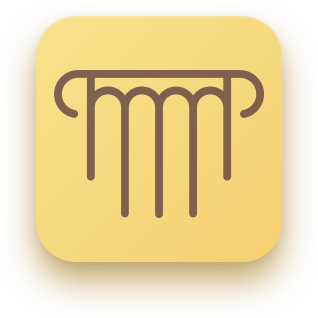
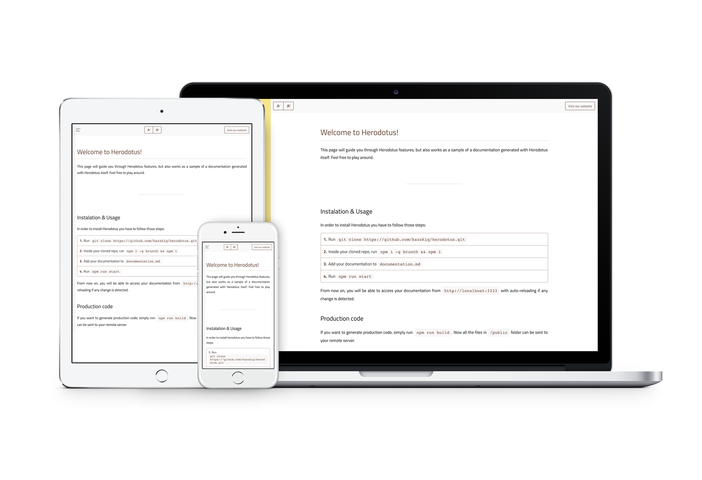

  
   
  <h2 align="center">Herodotus</h2>
  <h4 align="center">A blazing-fast, mobile-friendly documentation generator.</h4>

----

Herodotus is a project created to help you easily write your documentations and generate an extremely fast, lean and responsive-ready website. Writing docs should not be a pain, and now it isn't.

## How to use & Documentation
#### Website: https://kazzkiq.github.io/herodotus/
#### Documentation: https://kazzkiq.github.io/herodotus/documentation/
